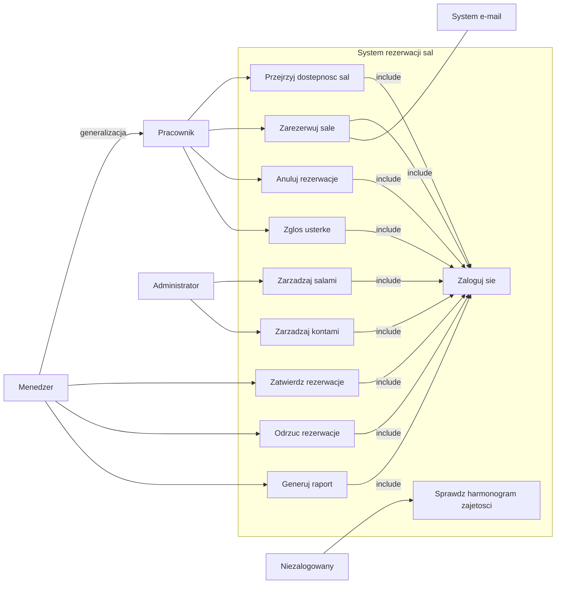

```mermaid

graph LR
    subgraph SYS["System rezerwacji sal"]
        UC1["Przejrzyj dostepnosc sal"]
        UC2["Zarezerwuj sale"]
        UC3["Anuluj rezerwacje"]
        UC4["Zatwierdz rezerwacje"]
        UC_Odrzuc["Odrzuc rezerwacje"]
        UC5["Zaloguj sie"]
        UC6["Zarzadzaj salami"]
        UC7["Generuj raport"]
        UC8["Zglos usterke"]
        UC10["Zarzadzaj kontami"]
        UC11["Sprawdz harmonogram zajetosci"]
    end

    %% Aktorzy
    N["Niezalogowany"]
    P["Pracownik"]
    M["Menedzer"]
    A["Administrator"]
    E["System e-mail"]

    %% Generalizacja
    M -->|generalizacja| P

    %% Przypisanie aktorow bezposrednich do celow
    N --> UC11
    P --> UC1 & UC2 & UC3 & UC8
    M --> UC4 & UC_Odrzuc & UC7
    A --> UC6 & UC10

    %% Relacje Include do logowania
    UC1 -->|include| UC5
    UC2 -->|include| UC5
    UC3 -->|include| UC5
    UC4 -->|include| UC5
    UC_Odrzuc -->|include| UC5
    UC6 -->|include| UC5
    UC7 -->|include| UC5
    UC8 -->|include| UC5
    UC10 -->|include| UC5

    %% Alternatywne poprawne modelowanie powiadomien
    UC2 --- E

```
    UC3 --- E
    UC4 --- E
    UC_Odrzuc --- E
